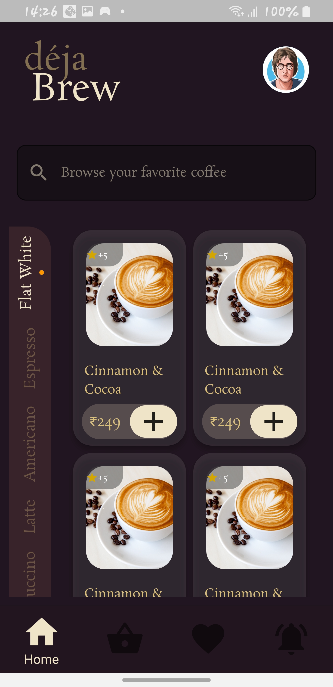
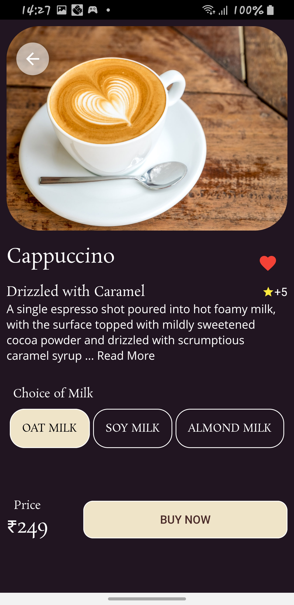
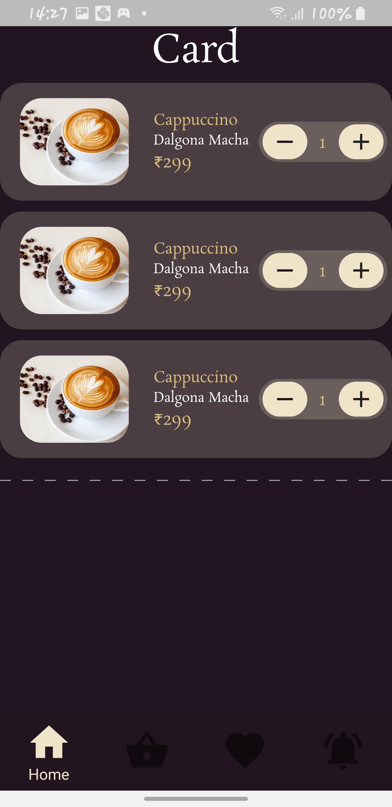

# kevmax

Cofee Ui Design With Flutter

## Getting Started

This project is a starting point for a Flutter application.

A few resources to get you started if this is your first Flutter project:

- [Lab: Write your first Flutter app](https://flutter.dev/docs/get-started/codelab)
- [Cookbook: Useful Flutter samples](https://flutter.dev/docs/cookbook)

For help getting started with Flutter, view our
[online documentation](https://flutter.dev/docs), which offers tutorials,
samples, guidance on mobile development, and a full API reference.

## Appendix

The app is not yet complete. Please look at the figma file to complete the remaining page. Any Great help of a backend developer can help us to improve the app functionalities. 
- Just ping my address tebahprincewill6@gmail.com for more design

## Screenshots

## Acknowledgements

 - [Awesome Figma design](https://www.figma.com/file/cGzehUqG4AH7IvuCoCmsZx/Coffee-Delivery-App-Exploration-(Community)?node-id=1%3A2)
 - [Awesome README](https://github.com/matiassingers/awesome-readme)
 

## Badges

## Authors

- [Jayprince20](https://github.com/Jayprince20)
